# Relatório Final — Generative Jazz (GenJazz)
**Unidade Curricular:** Interação Humano-Computador  
**Projeto — Parte 2**

---

## a. Documentação — Manual do Utilizador

### O que é o GenJazz?

O GenJazz é uma aplicação móvel educacional que permite gerar progressões harmónicas de jazz de forma automática. O utilizador configura parâmetros musicais (tonalidade, estrutura e modulação) e a aplicação devolve uma progressão de acordes acompanhada de reprodução áudio, grelha de compassos e círculo das quintas interativo. As progressões podem ser guardadas numa biblioteca pessoal para consulta futura.

---

### Requisitos

- Dispositivo com browser moderno (Chrome, Safari, Firefox)
- Ligação à internet (para carregamento de fontes e API de progressões)
- A aplicação é responsiva e funciona em qualquer telemóvel, incluindo dispositivos com notch ou indicador home

---

### 1. Primeiro acesso — Ecrã de Boas-Vindas

Ao abrir a aplicação pela primeira vez é apresentado o **Ecrã de Boas-Vindas** com as opções de criar conta ou entrar.

  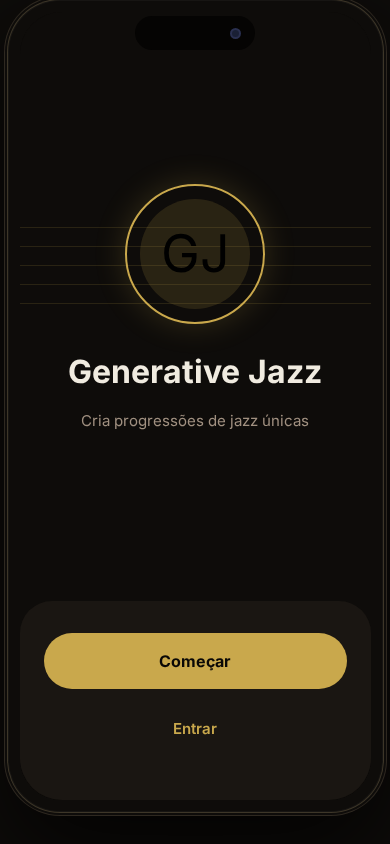

Tocar em **Começar** para criar uma conta nova, ou em **Entrar** para aceder a uma conta já existente.

---

### 2. Registo

Para criar uma conta nova:

1. Tocar em **Começar** no ecrã de boas-vindas
2. Na página de registo, preencher:
   - **Nome** — nome que será apresentado na aplicação
   - **Email** — endereço de email válido
   - **Palavra-passe** — mínimo de 8 caracteres
3. Tocar em **Criar Conta**

  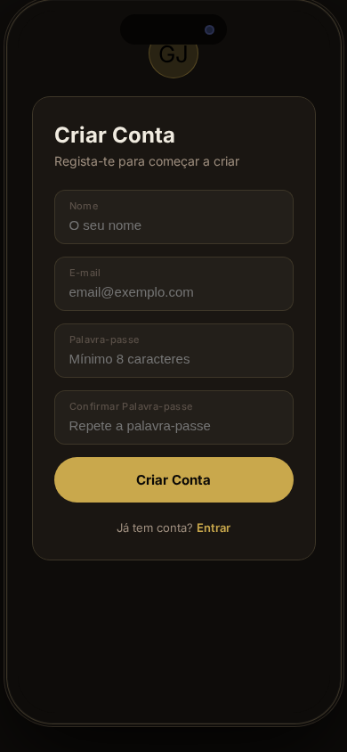

> Os dados são guardados localmente no dispositivo. Não existe servidor externo de autenticação.

---

### 3. Entrar na conta

Caso já tenha conta:

1. Tocar em **Entrar** no ecrã de boas-vindas
2. Introduzir email e palavra-passe
3. Tocar em **Entrar**

  

---

### 4. Ecrã Principal (Home)

Após autenticação, o utilizador é direcionado para o ecrã principal.

  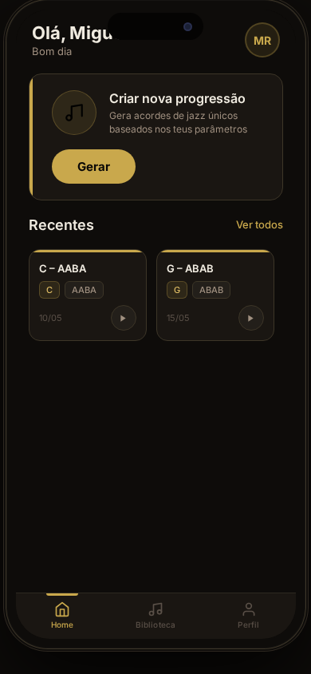

O ecrã apresenta:

- **Saudação personalizada** — varia conforme a hora do dia (Bom dia / Boa tarde / Boa noite)
- **Botão "Gerar"** — inicia o fluxo de geração de uma nova progressão
- **Progressões Recentes** — cartões das últimas progressões geradas com data e opção de reprodução rápida

---

### 5. Gerar uma Progressão

1. Tocar em **Gerar** no ecrã principal
2. No **Ecrã de Geração**, configurar os parâmetros:

| Parâmetro | Descrição | Opções |
|---|---|---|
| **Tonalidade (Key)** | Tom base da progressão | Seleção interativa no Círculo das Quintas; "Aleatório" para gerar sem preferência |
| **Estrutura** | Forma musical da progressão | Random, AABA, AABC, ABAB |
| **Modulação** | Tipo de mudança harmónica entre secções | Random, Dominant, Relative, Subdominant, Parallel, Chromatic |

  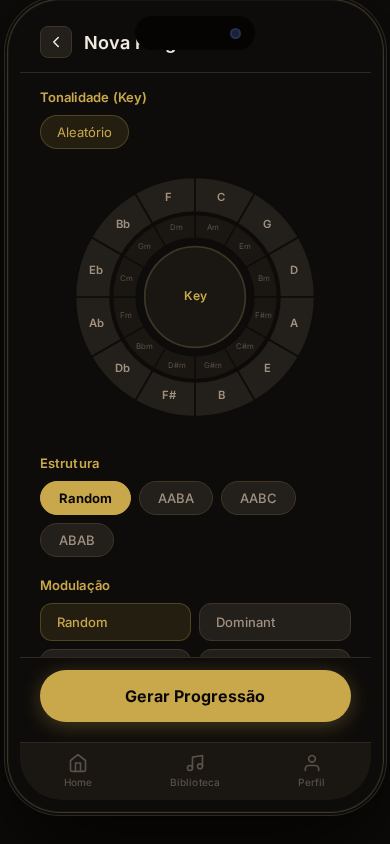

3. Tocar em **Gerar Progressão**
4. Aguardar o processamento (indicado por animação)

> O Círculo das Quintas é interativo — tocar em qualquer nota seleciona essa tonalidade. Tocar "Aleatório" desseleciona e delega a escolha à API.

---

### 6. Ecrã de Resultado

Após a geração, é apresentado o resultado com a progressão de acordes organizada por compassos.

  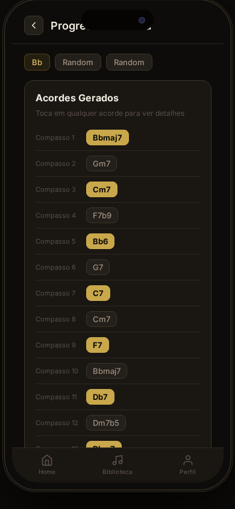

O ecrã apresenta:

- **Cabeçalho** com informação de tonalidade, estrutura e modulação utilizadas
- **Leitor de áudio** — reproduz a progressão gerada; inclui botão de play/pause e barra de progresso
- **Grelha de Compassos** — visualização dos acordes organizados por compasso, com destaque no acorde ativo durante a reprodução

Ações disponíveis:

| Botão | Função |
|---|---|
| **Guardar** | Abre painel para nomear e guardar a progressão na biblioteca |
| **Nova** | Regressa ao ecrã de geração para criar uma nova progressão |
| **← (voltar)** | Regressa ao ecrã principal |

**Guardar uma progressão:**
1. Tocar em **Guardar**
2. Editar o nome sugerido (gerado automaticamente com base na tonalidade e estrutura) ou manter o padrão
3. Tocar em **Guardar Progressão**

---

### 7. Biblioteca

A **Biblioteca** lista todas as progressões guardadas pelo utilizador.

  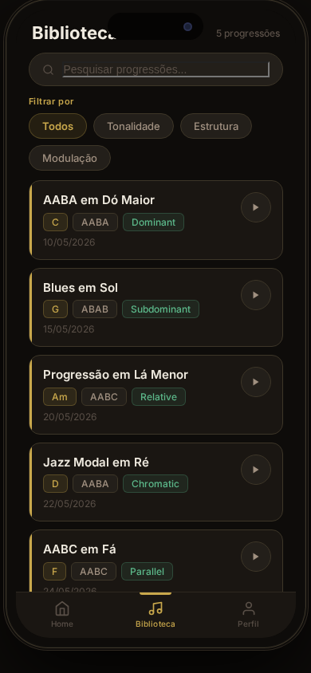

Funcionalidades:

- **Pesquisa** — campo de texto que filtra por nome, tonalidade ou estrutura em tempo real
- **Filtros por categoria** — permite filtrar por tonalidade ou estrutura específica
- **Reprodução rápida** — cada item tem botão de play direto
- **Detalhes** — apresenta tonalidade, estrutura, modulação e data de criação

Para aceder à biblioteca, tocar no ícone **Biblioteca** na barra de navegação inferior.

---

### 8. Perfil e Definições

O ecrã de **Perfil** permite gerir a conta e as preferências da aplicação. Acede-se pelo ícone de utilizador na barra de navegação inferior.

  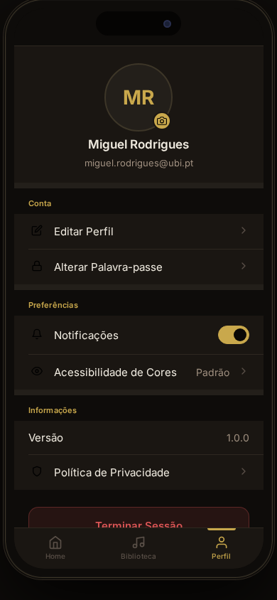

#### 8.1 Editar Perfil

1. Tocar em **Editar Perfil** ou na fotografia de perfil
2. Alterar nome de utilizador e/ou fotografia de perfil (JPG/PNG até 5 MB)
3. Tocar em **Guardar alterações**

#### 8.2 Alterar Palavra-passe

1. Tocar em **Alterar Palavra-passe**
2. Introduzir a palavra-passe atual
3. Introduzir e confirmar a nova palavra-passe (mínimo 8 caracteres)
4. Tocar em **Alterar palavra-passe**

#### 8.3 Notificações

Toggle para ativar ou desativar notificações da aplicação.

#### 8.4 Acessibilidade de Cores

A aplicação inclui suporte a diferentes tipos de daltonismo. Para configurar:

1. Tocar em **Acessibilidade de Cores** na secção Preferências
2. Selecionar o modo adequado no painel que abre:

  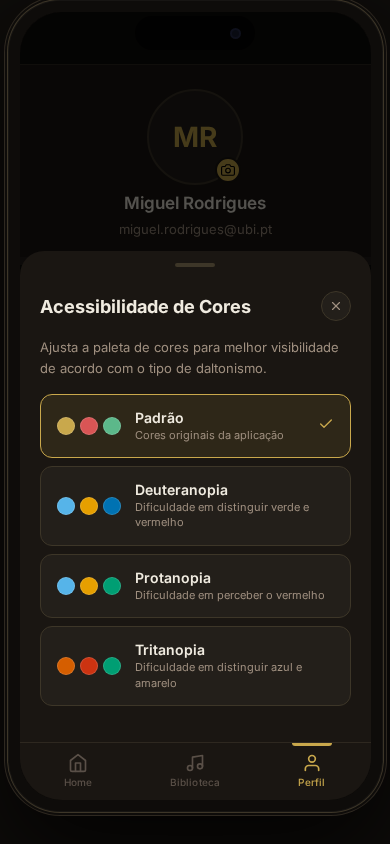

| Modo | Indicado para |
|---|---|
| **Padrão** | Utilizadores sem necessidades especiais de cor |
| **Deuteranopia** | Dificuldade em distinguir verde e vermelho (tipo mais comum) |
| **Protanopia** | Dificuldade em perceber o vermelho |
| **Tritanopia** | Dificuldade em distinguir azul e amarelo |

3. A paleta de cores da aplicação ajusta-se imediatamente. A preferência é guardada e aplicada em sessões futuras.

> Cada opção apresenta uma pré-visualização das três cores principais da paleta correspondente.

#### 8.5 Política de Privacidade

Apresenta informação sobre o âmbito educacional da aplicação, o uso da API GenJazz, e os direitos do utilizador relativamente aos seus dados.

  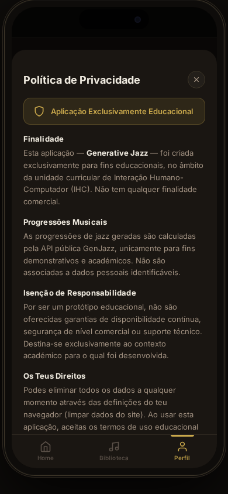

#### 8.6 Terminar Sessão

Tocar em **Terminar Sessão** para sair da conta e regressar ao ecrã de boas-vindas.

---

### 9. Navegação

A barra de navegação inferior está sempre visível nos ecrãs autenticados e dá acesso direto a:

| Ícone | Destino |
|---|---|
| Casa | Ecrã Principal |
| Nota musical | Biblioteca |
| Utilizador | Perfil |

---

## b. Alterações ao Protótipo da 1.ª Parte

### Alteração 1 — Acessibilidade de Cor para Utilizadores com Daltonismo

**Descrição da alteração**

Foi adicionada uma funcionalidade de acessibilidade de cor nas definições do perfil do utilizador, acessível através da opção "Acessibilidade de Cores". A funcionalidade oferece quatro modos com paletas distintas:

- **Padrão** — paleta original da aplicação (dourado/âmbar)
- **Deuteranopia** — paleta substituída por azul celeste (`#56B4E9`), laranja (`#E69F00`) e azul escuro (`#0072B2`), adequada para quem tem dificuldade em distinguir verde de vermelho
- **Protanopia** — semelhante à deuteranopia mas com a cor de sucesso ajustada para verde-azulado (`#009E73`), mais discriminável para quem tem sensibilidade reduzida ao vermelho
- **Tritanopia** — paleta substituída por vermelho-laranja (`#D55E00`) e verde-azulado (`#009E73`), para quem não distingue azul de amarelo

As imagens abaixo mostram o ecrã principal nos modos padrão e deuteranopia, evidenciando a diferença de paleta:

  
  &nbsp;&nbsp;&nbsp;
  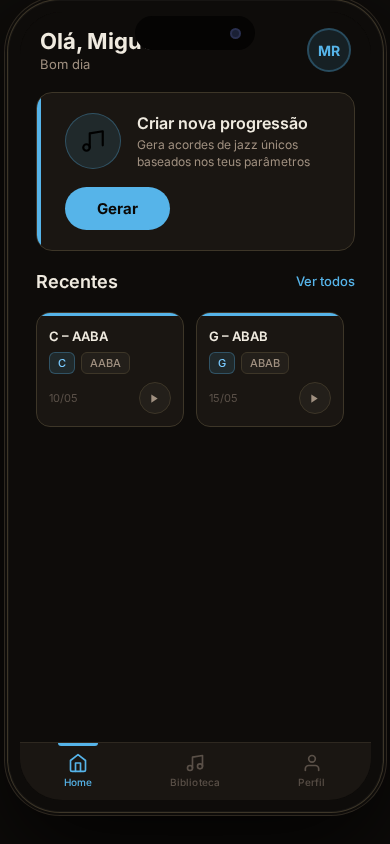

<em>Esquerda: paleta padrão (dourado). Direita: modo Deuteranopia (azul).</em>

O ecrã de seleção permite ao utilizador visualizar previamente as cores de cada modo antes de confirmar:

  

Tecnicamente, a alteração é implementada através de:
- Sobreposição de variáveis CSS ao nível do elemento raiz (`html[data-colorblind="..."]`), substituindo `--accent`, `--danger` e `--success`
- Persistência da preferência em `localStorage` com a chave `gj_colorblind`
- As cores estruturais da interface (fundos, bordas, texto) mantêm-se inalteradas, evitando ruturas de contraste

**Justificação**

A acessibilidade é um requisito fundamental de usabilidade e uma das heurísticas de Nielsen aplicadas ao projeto (H4 — consistência; H7 — flexibilidade e eficiência). A deuteranopia afeta aproximadamente 5–6% da população masculina, o que representa uma fração significativa de potenciais utilizadores. Não incluir suporte a diferentes tipos de visão cromática seria uma barreira de exclusão num projeto que se pretende universalmente utilizável.

As cores escolhidas para cada modo seguem a paleta de cores seguras para daltonismo de Wong (2011), amplamente adotada na comunidade científica para comunicação visual inclusiva. A implementação via variáveis CSS garante que a alteração é aplicada globalmente e de forma consistente, sem duplicação de lógica por componente.

---

### Alteração 2 — Política de Privacidade e Termos de Utilização

**Descrição da alteração**

Foi adicionada uma secção de **Política de Privacidade** acessível a partir do perfil do utilizador, sob a secção "Informações". A secção apresenta, em linguagem simples e organizada:

1. **Finalidade** — declaração explícita de que a aplicação é exclusivamente educacional, no âmbito da UC de Interação Humano-Computador, sem fins comerciais
2. **Progressões Musicais** — esclarecimento de que os dados musicais são processados pela API pública GenJazz para fins demonstrativos e não são associados a dados pessoais identificáveis
3. **Isenção de Responsabilidade** — aviso de que se trata de um protótipo académico sem garantias de disponibilidade, segurança de nível comercial ou suporte técnico
4. **Direitos do Utilizador** — informação sobre como eliminar todos os dados (limpeza de dados do site no browser) e declaração de aceitação dos termos ao usar a aplicação

  

**Justificação**

A transparência para com o utilizador é um princípio ético e legal. O Regulamento Geral sobre a Proteção de Dados (RGPD) exige que os utilizadores sejam informados sobre o tratamento dos seus dados, mesmo em contexto académico e mesmo quando os dados são armazenados localmente. Além disso, do ponto de vista de IHC, a confiança do utilizador no sistema é um fator determinante para a adoção e satisfação — um utilizador que não sabe como os seus dados são tratados tende a usar a aplicação com reservas ou a abandoná-la.

A política de privacidade serve também para delimitar claramente o âmbito do trabalho: o utilizador compreende que está perante um protótipo educacional e não um serviço comercial, o que enquadra corretamente as suas expectativas e reduz potencial frustração por limitações funcionais inerentes ao contexto académico.

---

## c. Decisões de Design — Paleta de Cores e Tipografia

### Paleta de Cores — Modo Padrão

A aplicação adota um tema escuro como base, com um acento dourado/âmbar como cor de destaque principal. Cada escolha tem uma justificação funcional e estética:

#### Fundo escuro (`#0e0c0a` — preto quente)

O fundo utiliza um preto com subtom castanho-quente em vez de um preto puro (`#000000`). Esta escolha tem dois objetivos:

1. **Redução da fadiga ocular** — ecrãs totalmente pretos com texto branco criam um contraste OLED muito elevado que pode ser desconfortável em sessões prolongadas. O subtom quente suaviza esse efeito sem comprometer a legibilidade.
2. **Coerência temática** — a tonalidade evoca o ambiente de um clube de jazz: espaços intimistas e com iluminação ténue. Esta associação visual contextualiza o utilizador no universo musical da aplicação.

#### Acento dourado/âmbar (`#c9a84c`)

O dourado é a cor de destaque para todos os elementos interativos e de ênfase (botões, ícones ativos, acordes em destaque).

- **Referência aos instrumentos de sopro** — o saxofone, a trompete e o trombone, instrumentos centrais no jazz, têm uma cor de latão que corresponde diretamente a este tom âmbar-dourado.
- **Contraste adequado** — o dourado sobre fundo escuro oferece um rácio de contraste que cumpre as diretrizes WCAG 2.1 AA para texto normal e grande, garantindo legibilidade.
- **Identidade visual do "Golden Age of Jazz"** — a época de ouro do jazz (anos 1920–1960) está associada visualmente ao calor das luzes de palco, cartazes vintage e tampas de discos de vinil. O uso do dourado ancora a interface nessa estética.

#### Texto principal (`#f0ebe0` — branco quente)

Em vez de branco puro, o texto principal usa um tom ligeiramente creme. Este detalhe evita o contraste extremo branco/preto, que embora tecnicamente maximize a legibilidade, pode ser percetivamente agressivo em contexto de tema escuro. O subtom quente mantém coerência com a paleta geral.

#### Texto secundário (`#a09080` — cinzento quente)

Cria hierarquia visual clara entre informação primária (nome do acorde, título do ecrã) e secundária (data, descrições, labels). A tonalidade quente mantém harmonia com o restante sistema de cores.

#### Perigo/Erro (`#d95555` — vermelho suave) e Sucesso (`#5cb88a` — verde-azulado)

- O **vermelho** é semanticamente universal para indicar erros e ações destrutivas (como terminar sessão).
- O **verde-azulado** (teal) para sucesso foi preferido ao verde puro para garantir maior distância percetiva relativamente ao vermelho, reduzindo já na paleta padrão o risco de confusão para utilizadores com visão cromática limítrofe.

A imagem abaixo ilustra a paleta padrão aplicada nos ecrãs principais:

  
  &nbsp;
  
  &nbsp;
  

<em>Paleta padrão aplicada nos ecrãs de boas-vindas, principal e perfil.</em>

---

### Paleta de Cores — Modos de Acessibilidade para Daltonismo

Os três modos de acessibilidade substituem exclusivamente as variáveis de cor semântica (`--accent`, `--danger`, `--success`), preservando os fundos e tons de texto que já são neutros e não dependem de distinção cromática. As cores foram selecionadas a partir da **paleta de Wong (2011)**, desenvolvida no Broad Institute especificamente para garantir discriminabilidade em todos os principais tipos de deficiência de visão cromática.

#### Deuteranopia — incapacidade/dificuldade de perceber o verde (~5–6% da população masculina)

| Papel | Cor padrão | Cor acessível | Motivo |
|---|---|---|---|
| Acento principal | `#c9a84c` (dourado) | `#56B4E9` (azul céu) | O dourado tem componente verde que o torna difícil de distinguir de outros tons para deuteranopes; o azul céu é claramente percetível |
| Perigo/Erro | `#d95555` (vermelho) | `#E69F00` (laranja) | O vermelho é a cor mais afetada na deuteranopia; o laranja é percebido com alta fidelidade |
| Sucesso | `#5cb88a` (verde) | `#0072B2` (azul escuro) | O verde é praticamente indistinguível do amarelo/castanho para deuteranopes; o azul escuro cria contraste máximo com o laranja do perigo |

#### Protanopia — ausência/redução da sensibilidade ao vermelho (~1% da população masculina)

| Papel | Cor padrão | Cor acessível | Motivo |
|---|---|---|---|
| Acento principal | `#c9a84c` (dourado) | `#56B4E9` (azul céu) | Idêntico à deuteranopia; o dourado tem componente vermelho afetada |
| Perigo/Erro | `#d95555` (vermelho) | `#E69F00` (laranja) | O vermelho é a cor diretamente afetada na protanopia |
| Sucesso | `#5cb88a` (verde) | `#009E73` (verde-azulado) | Ao contrário da deuteranopia, protanopes conseguem distinguir verdes deslocados para o ciano; o verde-azulado é suficientemente distinto do laranja |

#### Tritanopia — incapacidade/dificuldade de perceber o azul (rara, ~0,01% da população)

| Papel | Cor padrão | Cor acessível | Motivo |
|---|---|---|---|
| Acento principal | `#c9a84c` (dourado) | `#D55E00` (vermelhão) | O dourado/amarelo é diretamente afetado na tritanopia; o vermelhão é um dos tons mais preservados |
| Perigo/Erro | `#d95555` (vermelho) | `#CC3311` (vermelho-laranja) | O vermelho mantém-se mas com maior saturação para se distinguir do acento |
| Sucesso | `#5cb88a` (verde) | `#009E73` (verde-azulado) | O verde com componente ciano é bem percetível por tritanopes pois não depende da distinção azul/amarelo |

  
  &nbsp;
  
  &nbsp;
  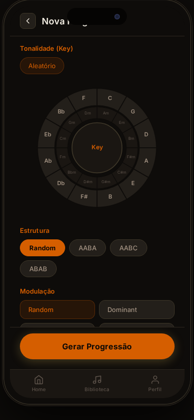

<em>Da esquerda para a direita: modo padrão (dourado), deuteranopia (azul) e tritanopia (vermelhão).</em>

---

### Tipografia — Inter (sans-serif)

A tipografia da aplicação usa exclusivamente a família **Inter** em diferentes pesos (300 a 700), sem recorrer a fontes serifadas.

#### Porquê Inter

Inter é uma typeface de código aberto desenvolvida por Rasmus Andersson especificamente para interfaces de ecrã. As suas características técnicas são especialmente adequadas para aplicações móveis:

- **Abertura das letras elevada** — as aberturas nos caracteres `c`, `e`, `a`, `g` e semelhantes são mais largas do que em fontes genéricas, o que melhora a identificação individual de cada letra a tamanhos pequenos.
- **Altura-x alta** — a proporção entre letras minúsculas e maiúsculas é elevada, o que aumenta a área legível do texto em corpo pequeno sem necessidade de aumentar o tamanho de fonte.
- **Espessura de traço consistente** — os traços têm uma espessura mais uniforme do que outras fontes, o que reduz a vibração visual em ecrãs de densidade intermédia.
- **Pesos variados num único ficheiro** — ao usar apenas Inter com pesos 300, 400, 500, 600 e 700, consegue-se hierarquia tipográfica clara (títulos vs. corpo vs. labels) sem carregar múltiplas famílias tipográficas.

#### Porquê sans-serif em vez de serif

A versão inicial do protótipo usava **Playfair Display** (serifada) para títulos e cabeçalhos. Esta fonte foi removida pelas seguintes razões:

1. **Legibilidade em ecrã** — as serifas (pequenos traços decorativos nas extremidades das letras) foram concebidas para guiar o olho em texto impresso de alta resolução. Em ecrãs, especialmente a densidades médias (150–300 ppi típicos em smartphones Android), as serifas podem aparecer borradas ou com "aliasing", reduzindo a nitidez percebida.

2. **Consistência na interface** — uma interface com dois sistemas tipográficos distintos (serif para títulos, sans-serif para corpo) cria um atrito visual desnecessário. Com Inter em todos os elementos, a hierarquia é transmitida exclusivamente por tamanho e peso, o que é mais direto e previsível para o utilizador.

3. **Acessibilidade** — investigação na área da dislexia (British Dyslexia Association, 2023) indica que fontes sans-serif com formas simples e abertas são significativamente mais fáceis de ler para utilizadores com dislexia, por reduzirem a confusão entre letras de forma semelhante (como `b/d`, `p/q`, `n/u`).

4. **Conformidade com guidelines de design móvel** — tanto as Human Interface Guidelines da Apple como o Material Design da Google recomendam tipografia sans-serif para texto de interface, reservando opções serifadas apenas para conteúdo editorial de longa forma.

A tabela seguinte resume a hierarquia tipográfica aplicada:

| Elemento | Peso Inter | Tamanho típico | Uso |
|---|---|---|---|
| Títulos de ecrã | 700 (Bold) | 20–22 px | Nome do ecrã no cabeçalho |
| Títulos de secção | 600 (SemiBold) | 17–18 px | Títulos de cards, sheets |
| Corpo principal | 400 (Regular) | 14–15 px | Texto de parágrafos, descrições |
| Labels e chips | 500–600 (Medium/SemiBold) | 11–13 px | Categorias, metadados |
| Texto secundário | 300–400 (Light/Regular) | 11–13 px | Datas, hints, texto muted |

  
  &nbsp;&nbsp;
  

<em>Hierarquia tipográfica Inter aplicada no ecrã de resultado e no painel de acessibilidade.</em>

---

*Versão 1.0.0 · IHC 2025/2026 · Uso exclusivamente educacional*
